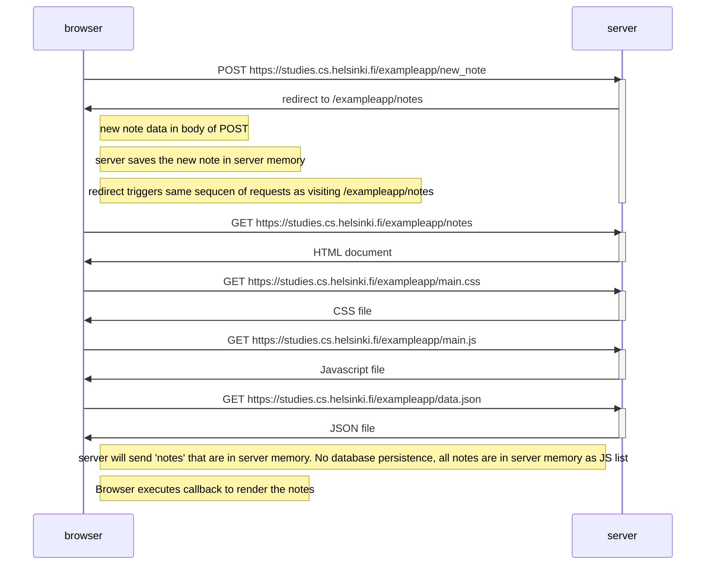

```mermaid
sequenceDiagram

    participant browser
    participant server
    browser->>server: POST https://studies.cs.helsinki.fi/exampleapp/new_note
    activate server
    server->>browser: redirect to /exampleapp/notes
    Note right of browser: new note data in body of POST
    Note right of browser: server saves the new note in server memory
    Note right of browser: redirect triggers same sequcen of requests as visiting /exampleapp/notes
    deactivate server

    browser->>server: GET https://studies.cs.helsinki.fi/exampleapp/notes
    activate server
    server->>browser: HTML document
    deactivate server

    browser->>server: GET https://studies.cs.helsinki.fi/exampleapp/main.css
    activate server
    server->>browser: CSS file
    deactivate server

    browser->>server: GET https://studies.cs.helsinki.fi/exampleapp/main.js
    activate server
    server->>browser: Javascript file
    deactivate server

    browser->>server: GET https://studies.cs.helsinki.fi/exampleapp/data.json
    activate server
    server->>browser: JSON file
    deactivate server
    Note right of browser: server will send 'notes' that are in server memory. No database persistence, all notes are in server memory as JS list

    Note right of browser: Browser executes callback to render the notes
```
